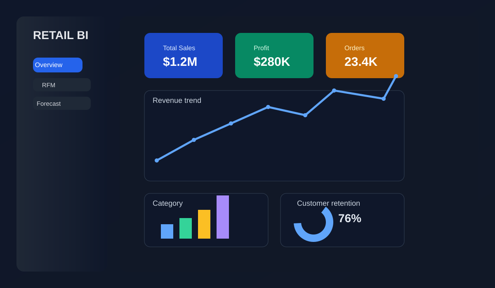

# BÀI TẬP LỚN PYTHON – DT04

## PHÂN TÍCH DOANH SỐ BÁN LẺ CHUỖI SIÊU THỊ

**Học phần:** Lập trình Python cho phân tích dữ liệu
**Ngành:** Công nghệ thông tin – Học kỳ 3, năm học 2025–2026
**Trường:** Đại học Sư phạm – Đại học Đà Nẵng – Khoa Toán – Tin
**Mã đề tài:** DT04

---

## 1. THÔNG TIN NHÓM

| STT | Họ và tên           | Mã sinh viên | Lớp     |
| --: | ------------------- | -----------: | ------- |
|   1 | Đoàn Hữu Dương      |   3120225034 | 25CNTT3 |
|   2 | Nguyễn Huy Bình     |   3120225014 | 25CNTT3 |
|   3 | Nguyễn Hồ Đại Phong |   3120225117 | 25CNTT3 |
|   4 | Nguyễn Bình An      |   3120225003 | 25CNTT3 |
|   5 | Đỗ Đức Dũng         |   3120225031 | 25CNTT3 |

---

## 2. CÀI ĐẶT NHANH

### 2.1. Tạo môi trường ảo

```bash
python -m venv .venv
```

Windows:

```bash
.venv\Scripts\activate
```

Linux/macOS:

```bash
source .venv/bin/activate
```

### 2.2. Cài đặt thư viện

```bash
pip install -r requirements.txt
```

### 2.3. Chạy dự án

```bash
python main.py
```

Chạy dashboard Streamlit:

```bash
python main.py --web
```

Hoặc chạy GUI desktop:

```bash
python main.py --gui
```

---

## 3. DEMO SCREENSHOT



> Hình minh họa giao diện tổng quan của dashboard phân tích doanh số bán lẻ.

---

## 4. GIỚI THIỆU

Dự án xây dựng một hệ thống phân tích doanh số bán lẻ cho chuỗi siêu thị bằng Python.

Hệ thống thực hiện đầy đủ quy trình từ đọc dữ liệu, tiền xử lý, phân tích, trực quan hóa đến dự báo doanh số.

Các thành phần chính của dự án gồm:

* Pipeline phân tích bằng CLI.
* Module xử lý và phân tích dữ liệu theo hướng đối tượng (OOP).
* Jupyter Notebook phục vụ phân tích và trực quan hóa.
* Streamlit Dashboard.
* Giao diện desktop bằng CustomTkinter.
* Phân tích RFM khách hàng.
* Phân tích giỏ hàng (Market Basket Analysis).
* Phân tích tác động của Discount đến Profit.
* Dự báo doanh số bằng SMA, EMA và Linear Regression.
* Kiểm thử bằng Pytest.

---

## 5. YÊU CẦU MÔI TRƯỜNG

### 3.1. Phiên bản Python

Khuyến nghị sử dụng:

```text
Python 3.8 trở lên
```

Nên sử dụng Python 3.11 trở lên để có môi trường ổn định với các thư viện trong dự án.

### 3.2. Cài đặt thư viện

Mở Terminal/Command Prompt tại thư mục gốc của project và chạy:

```bash
pip install -r requirements.txt
```

Nếu sử dụng môi trường ảo:

```bash
python -m venv .venv
```

Windows:

```bash
.venv\Scripts\activate
```

Sau đó:

```bash
pip install -r requirements.txt
```

> Lưu ý: `requirements.txt` cần chứa đầy đủ các thư viện mà project sử dụng, bao gồm cả `customtkinter` nếu chạy giao diện desktop.

---

## 6. CẤU TRÚC DỰ ÁN

```text
project/
├── README.md
├── requirements.txt
├── main.py
├── gui.py
├── notebook.ipynb
│
├── app/
│   ├── __init__.py
│   ├── app.py
│   ├── components/
│   │   ├── __init__.py
│   │   ├── charts.py
│   │   ├── kpi_cards.py
│   │   └── sidebar.py
│   └── pages/
│       ├── 1_Overview.py
│       ├── 2_Customer_RFM.py
│       └── 3_Sales_Forecast.py
│
├── data/
│   ├── README.md
│   ├── generate_data.py
│   ├── raw/
│   │   ├── Superstore.csv
│   │   └── Superstore.json
│   └── processed/
│       └── Superstore_clean.csv
│
├── outputs/
│
├── src/
│   ├── __init__.py
│   ├── data_loader.py
│   ├── retail_analyzer.py
│   └── sales_forecaster.py
│
└── tests/
    ├── __init__.py
    ├── test_data_loader.py
    └── test_retail_analyzer.py
```

---

## 7. DỮ LIỆU

### 5.1. Nguồn và định dạng dữ liệu

Dự án sử dụng dữ liệu bán lẻ Superstore.

Dữ liệu được lưu dưới hai định dạng:

```text
data/raw/Superstore.csv
data/raw/Superstore.json
```

Chương trình hỗ trợ đọc:

* CSV
* Excel
* JSON
* XML

Trong bài tập, dữ liệu chính được sử dụng là CSV và JSON.

### 5.2. Quy mô dữ liệu

Dataset sử dụng trong dự án có khoảng 650 bản ghi, đáp ứng yêu cầu tối thiểu 500 bản ghi.

Nếu cần tạo lại dữ liệu mẫu:

```bash
python data/generate_data.py
```

### 5.3. Một số trường dữ liệu chính

| Trường          | Ý nghĩa           |
| --------------- | ----------------- |
| `Order Date`    | Ngày đặt hàng     |
| `Ship Date`     | Ngày giao hàng    |
| `Customer ID`   | Mã khách hàng     |
| `Customer Name` | Tên khách hàng    |
| `Product Name`  | Tên sản phẩm      |
| `Category`      | Nhóm sản phẩm     |
| `Sub-Category`  | Nhóm sản phẩm con |
| `Region`        | Khu vực           |
| `Sales`         | Doanh số          |
| `Profit`        | Lợi nhuận         |
| `Discount`      | Mức giảm giá      |
| `Quantity`      | Số lượng sản phẩm |

---

## 8. TIỀN XỬ LÝ DỮ LIỆU

Toàn bộ logic tiền xử lý chính được tổ chức trong:

```text
src/data_loader.py
```

Pipeline tiền xử lý gồm các bước:

```text
Dữ liệu thô
    ↓
Đọc dữ liệu
    ↓
Chuẩn hóa tên cột
    ↓
Chuẩn hóa giá trị dạng text
    ↓
Kiểm tra và chuyển kiểu dữ liệu
    ↓
Xử lý giá trị thiếu
    ↓
Loại bỏ bản ghi trùng lặp
    ↓
Phát hiện ngoại lai bằng IQR
    ↓
Xử lý ngoại lai bằng IQR + Capping
    ↓
Tạo các trường thời gian
    ↓
Dữ liệu sạch
```

### 6.1. Chuẩn hóa tên cột và giá trị

Các khoảng trắng thừa trong tên cột và giá trị dạng chuỗi được loại bỏ để đảm bảo dữ liệu nhất quán.

### 6.2. Xử lý giá trị thiếu

* `Sales`: xử lý giá trị thiếu bằng median.
* `Profit`: xử lý giá trị thiếu theo quy tắc được cài đặt trong module tiền xử lý.

### 6.3. Xử lý dữ liệu trùng

Các bản ghi hoàn toàn trùng lặp được loại bỏ bằng Pandas.

### 6.4. Xử lý kiểu dữ liệu

Các trường ngày tháng được chuyển sang kiểu `datetime` để phục vụ phân tích theo thời gian.

### 6.5. Xử lý ngoại lai

Dự án sử dụng phương pháp IQR:

* Xác định Q1.
* Xác định Q3.
* Tính IQR.
* Xác định giới hạn dưới và giới hạn trên.
* Các giá trị vượt giới hạn được xử lý bằng phương pháp Capping.

Việc sử dụng Capping giúp hạn chế ảnh hưởng quá lớn của giá trị cực đoan mà không loại bỏ toàn bộ bản ghi.

### 6.6. Các trường thời gian được tạo thêm

Sau tiền xử lý, dữ liệu được bổ sung các trường:

* `Year`
* `Month`
* `YearMonth`
* `Quarter`
* `DayOfWeek`

Dữ liệu sạch được lưu tại:

```text
data/processed/Superstore_clean.csv
```

---

## 9. CÁC CHỨC NĂNG PHÂN TÍCH

### 7.1. Phân tích doanh số và lợi nhuận

Phân tích theo:

* Category
* Region
* YearMonth
* Quarter

Các chỉ tiêu chính:

* Tổng Sales.
* Tổng Profit.
* Số lượng bản ghi.
* So sánh giữa các nhóm.

### 7.2. Top sản phẩm

Xác định các sản phẩm có doanh số hoặc lợi nhuận cao.

### 7.3. Top khách hàng

Phân tích khách hàng theo giá trị mua hàng và lợi nhuận.

### 7.4. Phân tích RFM

Phân tích khách hàng dựa trên:

* `Recency`: thời gian kể từ lần mua gần nhất.
* `Frequency`: tần suất mua hàng.
* `Monetary`: giá trị mua hàng.

Từ đó hỗ trợ phân nhóm khách hàng.

### 7.5. Market Basket Analysis

Phân tích các nhóm sản phẩm thường xuất hiện cùng trong đơn hàng dựa trên `Sub-Category`.

### 7.6. Phân tích Discount và Profit

So sánh lợi nhuận giữa các nhóm mức giảm giá để tìm hiểu xu hướng giữa Discount và Profit.

> Phân tích tương quan hoặc xu hướng không được dùng để khẳng định quan hệ nhân quả.

### 7.7. Phân tích theo thời gian

Phân tích doanh số và lợi nhuận theo:

* Năm.
* Tháng.
* Quý.
* Thứ trong tuần.

---

## 10. TRỰC QUAN HÓA

Dự án sử dụng Matplotlib và các thư viện trực quan hóa phù hợp.

Các dạng biểu đồ được sử dụng gồm:

* Bar chart.
* Line chart.
* Scatter plot.
* Heatmap.
* Count plot và các biểu đồ phân phối phù hợp.

Mỗi biểu đồ được thiết lập:

* Tiêu đề.
* Nhãn trục.
* Chú giải khi cần thiết.
* Phần diễn giải kết quả.

---

## 11. DỰ BÁO DOANH SỐ

Module:

```text
src/sales_forecaster.py
```

thực hiện dự báo doanh số theo tháng bằng:

### 9.1. SMA

Simple Moving Average dùng trung bình trượt của các kỳ trước để ước lượng giá trị tiếp theo.

### 9.2. EMA

Exponential Moving Average đặt trọng số cao hơn cho các quan sát gần hiện tại.

### 9.3. Linear Regression

Sử dụng hồi quy tuyến tính để mô hình hóa xu hướng doanh số theo thời gian.

### 9.4. Đánh giá mô hình

Các chỉ số đánh giá gồm:

* MAE – Mean Absolute Error.
* MAPE – Mean Absolute Percentage Error.
* RMSE – Root Mean Squared Error.

---

## 12. TỔ CHỨC LẬP TRÌNH HƯỚNG ĐỐI TƯỢNG

Dự án tổ chức các chức năng chính thành các class/module:

### `DataLoader`

Chịu trách nhiệm:

* Đọc dữ liệu.
* Kiểm tra dữ liệu.
* Tiền xử lý.
* Chuẩn hóa.
* Xử lý giá trị thiếu.
* Xử lý trùng lặp.
* Xử lý ngoại lai.
* Tạo dữ liệu sạch.

### `RetailAnalyzer`

Chịu trách nhiệm:

* Phân tích doanh số.
* Phân tích lợi nhuận.
* Top sản phẩm.
* Top khách hàng.
* RFM.
* Market Basket.
* Phân tích Discount.
* Phân tích theo thời gian.

### `SalesForecaster`

Chịu trách nhiệm:

* Tổng hợp dữ liệu theo tháng.
* SMA.
* EMA.
* Linear Regression.
* Đánh giá mô hình.

Việc tách các class giúp mã nguồn dễ đọc, tái sử dụng và bảo trì.

---

## 13. JUPYTER NOTEBOOK

File:

```text
notebook.ipynb
```

được sử dụng để thực hiện quy trình phân tích và trực quan hóa.

Notebook cần được chạy theo thứ tự:

```text
Import thư viện
    ↓
Import các module trong src/
    ↓
Đọc dữ liệu
    ↓
Tiền xử lý
    ↓
Kiểm tra dữ liệu
    ↓
Phân tích
    ↓
Trực quan hóa
    ↓
Dự báo
    ↓
Đánh giá kết quả
```

### Kiểm tra Restart & Run All

Trước khi nộp bài, cần thực hiện:

```text
Restart Kernel
→ Run All
```

Notebook phải chạy từ đầu đến cuối mà không phát sinh lỗi.

Không thực hiện cài đặt package tự động bên trong notebook.

Việc cài thư viện được thực hiện thông qua:

```bash
pip install -r requirements.txt
```

---

## 14. CHẠY CHƯƠNG TRÌNH

### 12.1. Pipeline CLI

Từ thư mục gốc:

```bash
python main.py
```

Pipeline thực hiện:

1. Đọc dữ liệu.
2. Tiền xử lý.
3. Lưu dữ liệu sạch.
4. Phân tích dữ liệu.
5. Hiển thị các kết quả chính.

### 12.2. Streamlit Dashboard

Chạy:

```bash
streamlit run app/app.py
```

Hoặc nếu `main.py` hỗ trợ tùy chọn:

```bash
python main.py --web
```

Dashboard gồm:

* Overview.
* Customer RFM.
* Sales Forecast.

### 12.3. Giao diện desktop

Nếu muốn sử dụng giao diện CustomTkinter:

```bash
python main.py --gui
```

Điều kiện: các thư viện GUI phải được cài đặt trong `requirements.txt`.

### 12.4. Jupyter Notebook

Chạy:

```bash
jupyter notebook notebook.ipynb
```

Sau đó chọn:

```text
Kernel → Restart Kernel and Run All
```

để kiểm tra toàn bộ notebook.

---

## 15. KIỂM THỬ

Dự án có thư mục:

```text
tests/
```

với các file:

```text
tests/test_data_loader.py
tests/test_retail_analyzer.py
```

Chạy toàn bộ unit test:

```bash
python -m pytest tests/ -v
```

Unit test được sử dụng để kiểm tra các chức năng chính của module đọc/tiền xử lý dữ liệu và module phân tích.

---

## 16. CÁC FILE ĐẦU RA

### Dữ liệu

```text
data/processed/Superstore_clean.csv
```

### Kết quả phân tích

Các kết quả và biểu đồ được lưu tại thư mục:

```text
outputs/
```

hoặc các thư mục output được cấu hình trong từng module.

---

## 17. CÁC LỆNH NHANH

Sau khi cài đặt:

```bash
pip install -r requirements.txt
```

Chạy CLI:

```bash
python main.py
```

Chạy Streamlit:

```bash
streamlit run app/app.py
```

Chạy GUI:

```bash
python main.py --gui
```

Tạo lại dữ liệu:

```bash
python data/generate_data.py
```

Chạy unit test:

```bash
python -m pytest tests/ -v
```

---

## 18. XỬ LÝ MỘT SỐ LỖI THƯỜNG GẶP

### Lỗi không tìm thấy file dữ liệu

Kiểm tra:

```text
data/raw/Superstore.csv
```

Nếu file chưa tồn tại, có thể tạo lại dữ liệu bằng:

```bash
python data/generate_data.py
```

### Lỗi thiếu thư viện

Chạy:

```bash
pip install -r requirements.txt
```

### Lỗi khi chạy GUI

Kiểm tra `customtkinter` đã được cài đặt:

```bash
pip install customtkinter
```

Đồng thời kiểm tra package này đã được liệt kê trong `requirements.txt`.

### Lỗi khi chạy Streamlit

Kiểm tra:

```bash
pip install streamlit
```

và chạy:

```bash
streamlit run app/app.py
```

### Lỗi import module trong notebook

Đảm bảo Jupyter Notebook được mở từ thư mục gốc của project, nơi có:

```text
src/
data/
app/
notebook.ipynb
```

---

## 19. QUY TRÌNH CHẠY ĐỂ KIỂM TRA TRƯỚC KHI NỘP

Khuyến nghị kiểm tra theo thứ tự:

### Bước 1 – Cài đặt

```bash
pip install -r requirements.txt
```

### Bước 2 – Kiểm tra dữ liệu

Đảm bảo tồn tại:

```text
data/raw/Superstore.csv
data/raw/Superstore.json
```

### Bước 3 – Chạy unit test

```bash
python -m pytest tests/ -v
```

### Bước 4 – Chạy CLI

```bash
python main.py
```

### Bước 5 – Kiểm tra Notebook

Mở:

```text
notebook.ipynb
```

Sau đó:

```text
Restart Kernel → Run All
```

Đảm bảo toàn bộ cell chạy thành công.

### Bước 6 – Kiểm tra Dashboard

```bash
streamlit run app/app.py
```

### Bước 7 – Kiểm tra GUI

```bash
python main.py --gui
```

---

## 20. LƯU Ý KHI NỘP BÀI

Project cần được đóng gói sao cho có thể chạy từ thư mục gốc theo hướng dẫn trong README.

Không nên đưa vào file nén:

- `.venv/`
- `__pycache__/`
- file tạm của hệ điều hành
- các file không cần thiết có dung lượng lớn

Các file quan trọng cần có:

```text
README.md
requirements.txt
notebook.ipynb
src/
data/
tests/
```

Nếu dữ liệu nằm trong giới hạn cho phép, nên đóng gói trực tiếp dữ liệu đã sử dụng.

Nếu dữ liệu vượt giới hạn dung lượng cho phép, cần cung cấp link tải và hướng dẫn tải dữ liệu trong `README.md`.

---

## 21. TÓM TẮT

Dự án DT04 xây dựng một quy trình phân tích dữ liệu bán lẻ hoàn chỉnh gồm:

```text
Đọc dữ liệu
    ↓
Tiền xử lý
    ↓
Phân tích dữ liệu
    ↓
Trực quan hóa
    ↓
RFM
    ↓
Market Basket
    ↓
Discount – Profit
    ↓
Dự báo doanh số
    ↓
Đánh giá mô hình
    ↓
Dashboard / GUI
```

Mục tiêu của dự án là áp dụng Python, Pandas, NumPy, Matplotlib và các thư viện liên quan để xử lý, phân tích và trực quan hóa dữ liệu bán lẻ, đồng thời mở rộng bằng phân tích RFM, Market Basket Analysis và dự báo doanh số.
